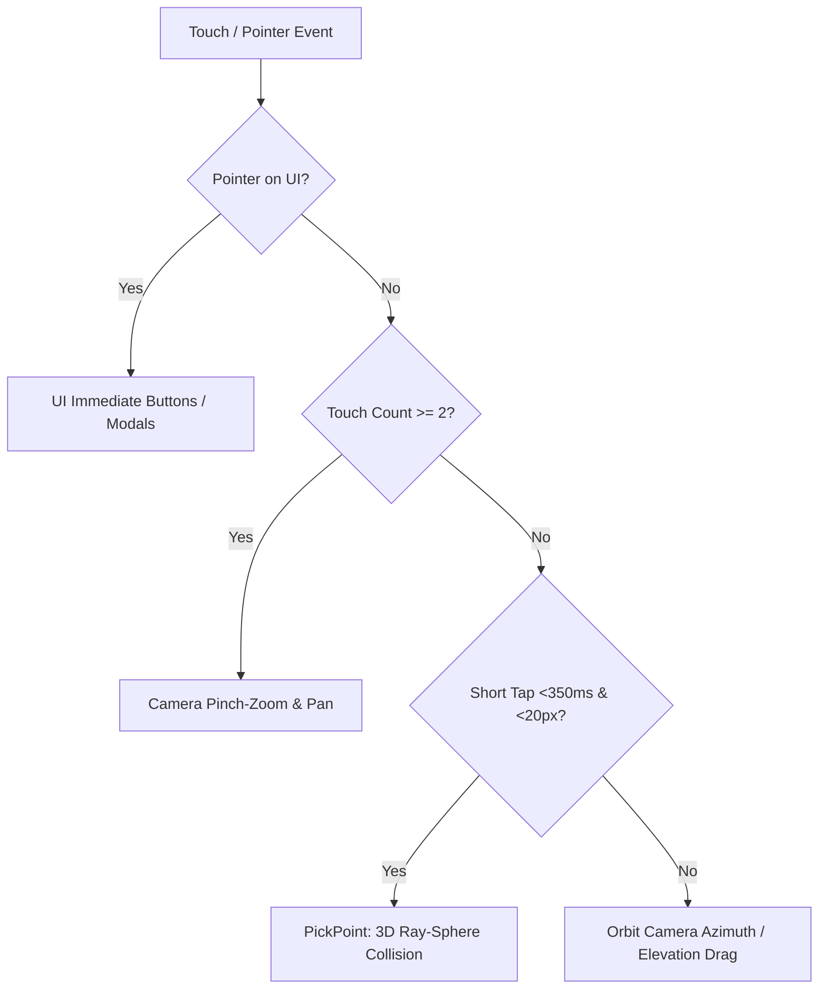

# Architecture Reference: Iris 3D & 4D Data Visualizer

This document details the modular architecture, coordinate mapping mathematics, ray picking, and touch event handling implemented in this codebase.

---

## 1. System Overview

The application is structured into 6 focused Go files:

File | Responsibility
:--- | :---
[`main.go`](file:///root/3dandroid/main.go) | NativeActivity entry point, frame loop, touch tap detection, Android Back key handler, UI event gatekeeper.
[`camera3d.go`](file:///root/3dandroid/camera3d.go) | Spherical coordinate orbit camera, pinch-to-zoom, two-finger pan, rotational inertia, turntable auto-rotation.
[`dataset.go`](file:///root/3dandroid/dataset.go) | Data structures, CSV parser with dynamic type sniffing, embedded datasets (Iris, Wine, Penguins, 4D Torus), normalization.
[`renderer.go`](file:///root/3dandroid/renderer.go) | 3D bounding box, coordinate grid, colored axes, sphere instances, floor drop lines, raycast point selection (`PickPoint`).
[`colormap.go`](file:///root/3dandroid/colormap.go) | Continuous colormaps (Viridis, Plasma, Cool-Warm, Turbo), categorical color palette, pulse animation oscillator.
[`ui.go`](file:///root/3dandroid/ui.go) | Immediate-mode UI buttons, modal dialogs (Datasets, Axes/4D mapping, View styles, CSV file browser), selected point HUD card.

---

## 2. Event Flow & Touch Handling

### Preventing Event Leakage
To prevent camera movements while clicking UI buttons:
- `ui.IsPointerOnUI(screenW, screenH, mousePos, isPointSelected)` is queried first.
- If `uiCaptured == true`, the camera input handler immediately resets pinch state and ignores drag inputs.

---

## 3. 3D Coordinate Mapping Mathematics

Given any arbitrary dataset with $N$ numeric columns:
1. Three columns are assigned to physical 3D space: $X$, $Y$, $Z$.
2. A fourth column is assigned to the 4th Dimension ($W$ or $4D$).
3. The bounding box defines ranges:
   - $X \in [-6.0, +6.0]$
   - $Y \in [-4.0, +4.0]$
   - $Z \in [-6.0, +6.0]$

### Normalization Formula
For raw value $v \in [\text{min}_c, \text{max}_c]$:
$$t = \frac{v - \text{min}_c}{\text{max}_c - \text{min}_c} \in [0.0, 1.0]$$
The 3D coordinate is mapped linearly:
$$\text{pos} = \text{BoxMin} + t \cdot (\text{BoxMax} - \text{BoxMin})$$

---

## 4. 4D Visual Encoding Modes

Mode | Visual Expression | Implementation Details
:--- | :--- | :---
**1. Continuous Colormap** | Gradient colormap applied to sphere surface. | Interpolated across Viridis, Plasma, CoolWarm, or Turbo using piecewise linear interpolation.
**2. Categorical Palette** | High-contrast distinct colors for discrete labels. | 10 distinct vibrant colors designed for dark backgrounds.
**3. Sphere Size** | Sphere radius scales with 4D magnitude. | $R = R_{\text{base}} \times (0.4 + 1.2 \cdot t)$.
**4. Dual (Color + Size)** | Simultaneous color ramp and size scaling. | Combines gradient colormap and radius modulation.
**5. Time Pulse** | Frequency-modulated pulsation over time. | Frequency $f = 1.5 + 3.0 \cdot t \text{ Hz}$, pulsing radius and glow.

---

## 5. 3D Raycast Picking (`PickPoint`)

Ray picking projects screen coordinates into 3D world space:
1. `rl.GetScreenToWorldRay(tapPos, cam)` computes a world-space `rl.Ray`.
2. `rl.GetRayCollisionSphere(ray, sphereCenter, hitRadius)` tests collision against all rendered data points.
3. The collision with the smallest positive distance (`collision.Distance < nearestDist`) is selected as `SelectedPoint`.
4. When selected:
   - A pulsing golden wireframe and crosshair indicators are drawn at the sphere's world position.
   - A floating HUD card is displayed on-screen showing the point's raw numeric coordinates, category name, and index.
